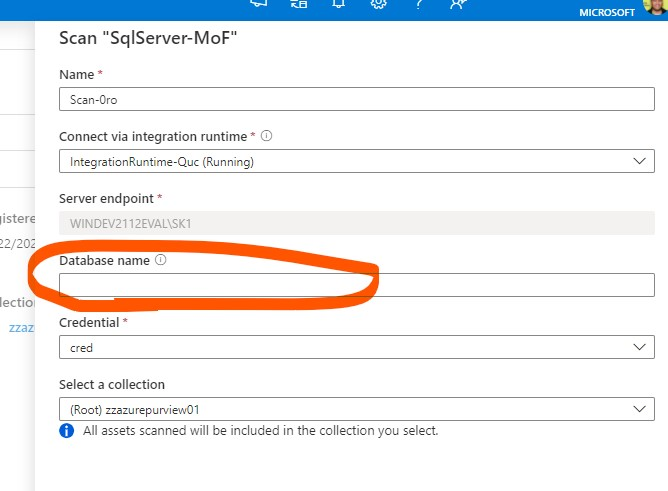

# azurepurview-api-createscan

# Azure Purview Scanning

When scanning OnPrem or Azure SQL servers with Purview, Purview allows only the below two options
    1. Scan all databases in a server
    2. Scan a single database in a server

Purview UI does not allow us to choose a set of databases that needs to be included in the scan.  If you have 100s of databases in a single server and if you need to exclude couple of databases in the scan, your only option is to configure individual scans for the rest of the 98 databases.

Setting up 100s of scans and triggers via the Purview UI manually is a time consuming process.  
This repo has a python code that programatically creates the scans/triggers via Purview APIs.

# Purview APIs for Scan and Trigger Creation
https://docs.microsoft.com/en-us/rest/api/purview/scanningdataplane/data-sources/list-all
https://docs.microsoft.com/en-us/rest/api/purview/scanningdataplane/triggers/get-trigger
https://docs.microsoft.com/en-us/rest/api/purview/scanningdataplane/scans/create-or-update

# Authentication to invoke Purview APIs
https://docs.microsoft.com/en-us/azure/purview/tutorial-using-rest-apis

# Structrue of the Config file

Scan Name|Database Name|Recurrence Frequency|Hour|Minute|Day of the Month|
--|--|--|--|--|--|
scandb01|AdventureWorks2019|Month|23|56|10
scandb02|db1|Month|13|56|10
scandb03|db2|Month|15|56|10
scandb04|db3|Month|17|56|10

# Steps
1. Setup Service Principal in Azure Active Directory
2. Get the tenant ID, Client ID and Secret
3. Grant permission for the Service Principal to invoke Purview APIs
4. Create Data Source manually in Purview UI
5. Create a single scan and trigger for a database via Purview UI (we will use this a template to create the rest of the scan via APIs)
6. Build the config file (.txt) with the list of databases
7. Run the 'purview api get scan and trigger.py' file and review the JSON output
8. Update the JSON output from the above in 'purview api create scan and trigger.py'
9. Execute the python code